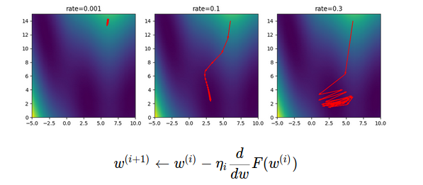
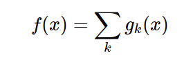
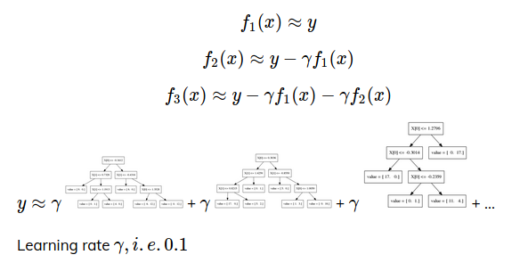

# Gradient Descent, Gradient Boosting

### Gradient descent
Technique to minimize a loss function by using the gradient of the function.



### Boosting
Family of algorithms to create "strong" learner f from "weak" learners gk.
You add a new model to fix the mistakes of the previous one.



### Gradient boosting
Most used models.
- First, you fit a simple model, like a tree based of depth one or two. This model is not going to work very well.
- Now, we look the residuals of the first model and fit a new model to them. We use a learning rate for the previous prediction. (gamma)
- Iterate this to k models.



- **Early stopping:** Adding trees can lead to overfitting. Stop adding trees when validation accuracy stops increasing.
- Two choices:
    1. pick number of trees and tune learning rate.
    2. pick learning rate, use early stopping.

- Tuning parameters:
    1. ```max_depth``` strong pruning
    2. ```max_features```
    3. ```column/row subsampling```
    4. ```Regularization```
    5. ```Learning rate + early stopping``` or ```n_estimators + tune learning rate```

- Use ```HistGradientBoostingClassifier``` instead of ```GradientBoostingClassifier```.

### GB implementations
**XGBoost**
- Supports missing values
- Automatic one hot Encoding
- GPU training

**LightGBM**
- Supports missing values
- Supports categorical variables
- GPU training
- Faster than XGBoost

**CatBoost**
- Optimized for categorical variables (target encoding)
- Supports missing values
- GPU training

### When to use tree-based models
- Non linear relationships
- Doesn't care about scaling, no need for feature engineering
- Very robust, good benchmark
- Gradient boosting often best performance with careful Tuning
