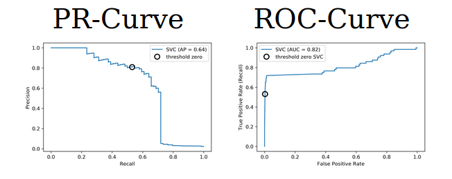

# Model evaluation

## Metrics for Binary Classification

- Positive and negative are arbitrary
- Though often the minority class is considered positive
- You can not conclude if a model is useful with accuracy.


- Precision: of all P predicted, how many were real.
- Recall: of all P real, how many we predict.

This two metrics are not useful by themselves: for example, you could get 100% recall predicting all P. That is why we look F score.

- Averaging strategies:
    1. **macro:** average of Recall for all classes.
    2. **weighted:** weighted average of Recall for all classes. (more samples of one class, more weight it will have)

- Balance accuracy:
```python
balanced_accuracy_score(y_true, y_pred) == recall_score(y_true,y_pred, average = 'macro')
```
*A good metric that capture the most is* ```macro avg recall```

#### Goal setting
- Depending on the goal, we will need more precision or more recall.
- We can tune this by changing thresholds (trade-off between precision and recall)



Comparing two models with PR-Curve:

```python
pr_svc = plot_precision_recall_curve(svc, X_test, y_test, name='SVC')
# if we used computed before, we could just call pr_svc.plot()
# using ax=plt.gca() will plot into the existing axes instead of creating  new ones
pr_rf = plot_precision_recall_curve(rf, X_test, y_test, ax=plt.gca())
```

- **Average Precision:** computes the average precision value for recall value over 0 to 1.

**Mistake:** *passing prediction instead of proba to roc_auc_score and average_precision_score*

## Metrics for regression models
- **Classics:** R2 (sensitive to outliers), MSE (easy to relate to input), MAE (more robust).
- **MAPE:** relative errors. Used a lot.
- **Predictions plots and residual plots:** to discover patterns.

## Using metrics in cross-validation
Multiple matrics
```python
from sklearn.model_selection import cross_validate
res = cross_validate(RandomForestClassifier(), X, y,
                     scoring=["accuracy", "average_precision",
                     "recall_macro"],
                     return_train_score=True,
                     cv=5)
pd.DataFrame(res)
```
