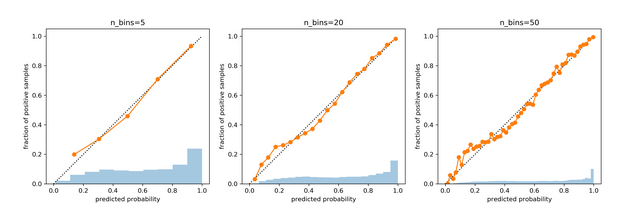
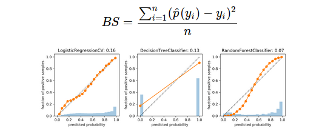
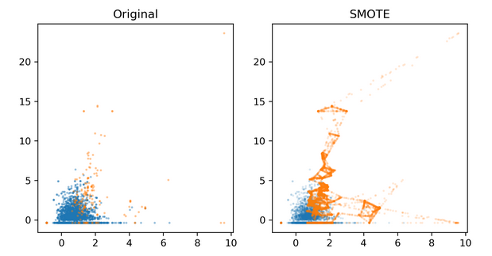

# Calibration, Imbalanced data

### Calibration curve (Reliability diagram)
Shows, for a given classifier and predictions, how much the probabilities match the real obserations.
1. Aggregates predicted probabilities into bins.
2. Calculates the (+) rate/frequency for each bin.
3. If the classifer is perfect, we expect a diagonal line.
The more diagonal the curve, the more precise will be the probability predictions. In a perfect clf, if the clf returns 0.3, 30% of the times will be class one.

```python
from sklearn.calibration import calibration_curve
probs = lr.predict_proba(X_test)[:, 1]
prob_true, prob_pred = calibration_curve(y_test, probs, n_bins=5)
```


*LogisticRegression has a good calibration*

- Brier Score (for binary classification)



### Calibrating a classifier
```python
cal_model = CalibratedClassifierCV(model, cv="prefit", method='sigmoid')
cal_model.fit(X_val, y_val)

cal_model_cv = CalibratedClassifierCV(model, method='isotonic')
cal_model_cv.fit(X_train, y_train)
```
Calibration doesn't improve any metric (like accuracy), only improves the calibration of the model.

### Imbalance data
- Changing thresholds: allow us to focus more in one class or on the other.
- Basic approach: Change the data --> add samples or remove samples --> both

Heuristic for imabalnced data:
1. **Random Undersampling:** undersample the mayority class.
2. **Random Oversampling:** sample with replacement the miniorty class.
3. **Class-weights:** instead of repeating samples, re-weight the loss function.

        ```python
        LogisticRegression(class_weight='balanced')
        RandomForestClassifier(class_weight='balanced')
        ```
4. **Ensemble Resampling:** for each tree we build a balanced sample, but every one will have different samples for the mayority class.

      ```python
      from imblearn.ensemble import BalancedRandomForestClassifier
      resampled_rf = BalancedRandomForestClassifier()

      #or

      tree = DecisionTreeClassifier()
      resampled_rf = BalancedBaggingClassifier(base_estimator=tree)
      ```
5. **SMOTE:** pick random neighbor from k neighbors, pick point on line connecting the two uniformly and repeat.


