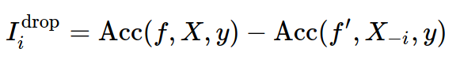

# Model Interpretation and Feature Selection

## 1. Feature importance
- Types of explanations:
	- **Explain model globally:** How does the output depend on the input?
	- **Explain model locally:** Why did it classify this point this way?

- Explaining the model != explaining the data:
	- Model inspection only tells you about the model
	- The model might not acurately reflect the data

- Features important to the model:
	- **Naive:**
		- ```coef_``` - linear models
		- ```feature_importances_``` - tree based models
	- **Linear Models coefficients:**
		- only meaningful after scaling.
		- correlation among features might make coefficients uninterpretable.
		- L1 picks one at random from a correlated group.
		- Any penalty will invalidate usual interpretation of linear coefficients.

### 1.1 Drop Feature Importance



- Doesn't really explain model, because we fit a new model in each iteration.
- Can't deal with correlated features well
- Very slow
- Can be used for feature selection

### 1.2 Permutation Importance
- Instead of dropping the feature, we shuffle the feature column and calculates the difference score N times (because we want the expected value of the difference).
- We don't fit a new model, we use a validation set.
- Very slow, but not as dropping features.
```python
from sklearn.inspection import permutation_importance
```

### 1.3 LIME
https://github.com/marcotcr/lime

### 1.4 SHAP
https://github.com/slundberg/shap

### 1.5 Partial dependence plots
Not only says how important a feature is, but also says how interact with the prediction.
Suppose you would like to understand importance of variable pi in the model, PDP builds the model averaging other predictor variable except one choosen predictor variable pi and measures change in response yhat and y, change in response can help identify how a varaible is affecting the model.


## 2. Feature selection
More interpretable model, faster prediction and training and less storage for model and dataset.

### 2.1 Unsupervised Feature Selection
- Covariance-based: remove correlated features
- Variance-based: 0 variance or mostly constant

### 2.2 Univariate Statistics
- Pick statistic, check p-values
- f_regression, f_classif, chi2
```python
from sklearn.feature_selection import SelectKBest, SelectPercentile, SelectFpr
```

### 2.3 Model-Based Feature selection
- Get best fit for a particular model.
- Ideally search over all combinations --> infeasible
- Use heuristics in practice.

#### 2.3.1 Model base (single fit)
- Build a model, select "features important to model"
- Lasso, tree based models.

```python
from sklearn.feature_selection import SelectFromModel
select_lasso = SelectFromModel(LassoCV(), threshold=1e-5)
pipe = make_pipeline(StandardScaler(),
										 select_lasso,
										 RidgeCV())
```
#### 2.3.2 Iterative Model-Based Selection
Fit model, find least important feature, remove, iterate.
Or: start with single feature, find most important feature, add, iterate.
- Recursive Feature Elimination: iteratively removes feature.
- Runtime: (n_features - n_features_to_keep) / stepsize

```python
from sklearn.feature_selection import RFE

rfe = RFE(LinearRegression(), n_features_to_select=1)
rfe.fit(X_train, y_train)
rfe.ranking_
```

```python
from sklearn.feature_selection import RFECV

rfe = RFECV(LinearRegression(), cv=10)
rfe.fit(X_train, y_train)
rfe.support_
```

**Powerful pipeline:**
```python
from sklearn.preprocessing import PolynomialFeatures

pipe_rfe_ridgecv = make_pipeline(StandardScaler(), PolynomialFeatures(),
                                 RFECV(LinearRegression(), cv=10), RidgeCV())
np.mean(cross_val_score(pipe_rfe_ridgecv, X_train, y_train, cv=10))
```
## 2.4 Wrapper methods
- Can be applied for any model, shrink/grow frature set by greedy search.
- Called Forward or Backward Selection
- Run CV per feature
- Implemented in mlxtend

```python
from mlxtend.feature_selection import SequentialFeatureSelector

sfs = SequentialFeatureSelector(LinearRegression(), forward=False, k_features=7)
sfs.fit(X_train, y_train)
sfs.k_feature_idx_
```
