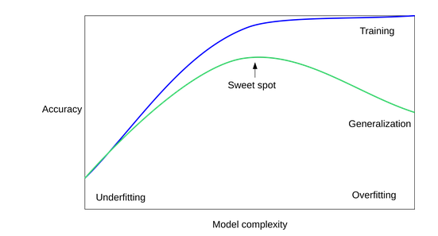
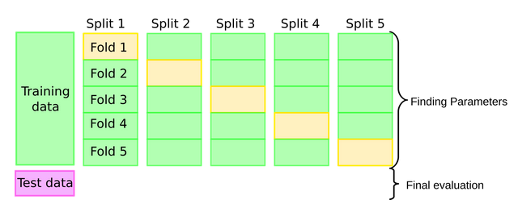

# Supervised learning

### Nearest Neighbors
One of the simplest ML model.

- In k-NN classification, the output is a class membership. An object is classified by a plurality vote of its neighbors, with the object being assigned to the class most common among its k nearest neighbors (k is a positive integer, typically small). If k = 1, then the object is simply assigned to the class of that single nearest neighbor.

- In k-NN regression, the output is the property value for the object. This value is the average of the values of k nearest neighbors.

*We can avoid overfitting by increasing the number of neighbors.*

### Threefold split
- Training set: for building the model
- Validation set: to pick the best parameters
- Test set: to evaluate how well the models works

### Cross-Validation
- Pro: more stable, more data.
- Con: slower (don't use with Neural Networks)

#### Cross-Validation strategies
- **KFold:** split the data into K parts (if the data is ordered we have to shuffle it)
- **Stratified KFold:** makes sure that every fold has the same ratio between classes that the dataset.
- **LeaveOneOut:** high variance, takes a long time.
- **ShuffleSplit:** repeatedly sample a test set with replacement.
- **RepeatedKFold:** apply KFold or StratifiedKFold multiple times with shuffled data (best one).
- **TimeSeriesSplit:** rolling windows with train + test. Also we can increase the train set in every fold.
