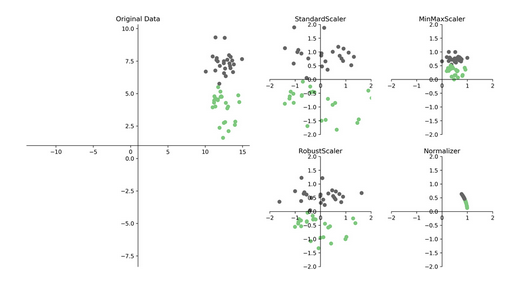
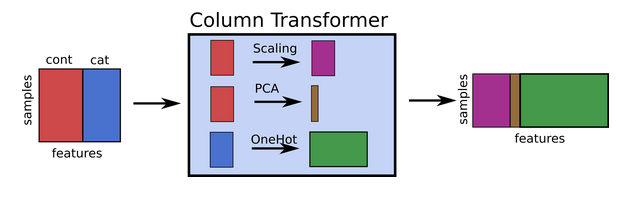
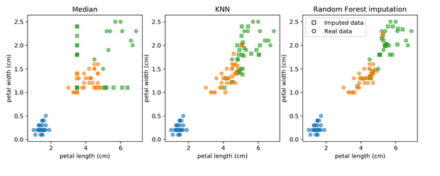

# Preprocessing and Feature transformations
One of the most important process.

## Scaling
Many algorithms are scale sensitive. Ther are several ways to scale data:
- **StandardScaler:** calculates mean, sustract it and divides by the standard deviation.
- **MinMaxScaler:** scales every value between 0 and 1. Useful with features that have very clear boundaries.
- **RobustScaler:** uses median and quantiles, it is robust with respect to outliers.
- **Normalizer:** rarely used.


*Sparce data:* only scale, don't center (use MaxAbsScaler). Because if we substract the mean to the 0 values, it converts to a dense data.

*Common error:* leaking information by applying some process (feature selection, scaling, balancing) before the Cross Validation loop. Need to include preprocessing in Cross Validation.

*Pipeline + GridSearchCV*
```python
knn_pipe = make_pipeline(StandardScaler(), KNeighborsRegressor())
param_grid = {'kneighborsregressor__n_neighbors': range(1, 10)}
grid = GridSearchCV(knn_pipe, param_grid, cv=10)
grid.fit(X_train, y_train)
print(grid.best_params_)
print(grid.score(X_test, y_test))
```

## Categorical variables
It is not always entirely clear if a feature is categorical or continuous.
- **Ordinal encoding:** it isn't good for a few categories.
```python
df['categorical_feature'] = df['categorical_feature'].astype("category").cat.codes
```
- **One-hot encoding:** encodes object and categorical dtypes. Introduces co-linearity, but it is not a big problem.
```python
pd.get_dummies(df)
```
-**Target encoding (impact encoding):** for high cardinality categorical features, instead of a lot of one hot variables, one response encoded variable. This encoding will overfit the train set.


```python
categorical = df.dtypes == object
preprocess = make_column_transformer(
    (StandardScaler(), ~categorical),
    (OneHotEncoder(), categorical))
model = make_pipeline(preprocess, LogisticRegression())
```

*Models supporting discrete features:* All tree based models, naive Bayes


### Missing values
- Can be encoded in many ways like: 999, ???, np.inf, np.nan, N/A, Unknown.
- Often missing values are informative. (Use missing flags -```python MissingIndicator```)
- Options:
        1. Delete column (if a lot of values for that column are missing)
        2. Delete row (if a lot of values for that row are missing)
        3. Imputation:
                - mean/median
                - kNN
                - Regression models
                - Matrix factorization

**Methodology approach:**
1. Baseline: Dropping columns/rows
2. Mean/median: ```python SimpleImputer()``` (adds noise)
3. kNN: ```python KNNImputer()``` (very slow on large datasets)
4. Model-Driven imputation: ```python imp = IterativeImputer(predictor = RandomForestRegressor())``` (never converges - not an issue)




*Normally, if you have a categorical missing value, you make a missing flag instead of imputation.*

*Be careful with leaking data (make pipeline)*