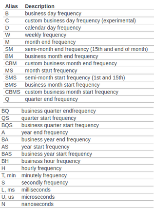

# Time series and Forecasting

### Task:
- 1D forecasting: single target/input.
- ND forecasting: multiple target/inputs.
- Feature based forecasting.
- Time series classification.

### Imputation
```python
Series.fillna(method="ffill", inplace=True)  # or bfill
```
*If we resample later, we could also just drop*

### Resampling
```python
Series.resample("MS").mean()
```


### 1D forecasting
Stationarity:
- Mean indepent of Time
- Variance independent of Time
- Covariance independent of Time

Autocorrelation:
```python
from pandas.tools.plotting import autocorrelation_plot
autocorrelation_plot(Series)
```

De-trending: removes the correlation between consecutive points
- Differencing (compute new series)
```python
Series.diff()
```

- AutoRegressive model: ```statsmodels.tsa.AutoReg```
- ARIMA: ```tsa.arima_model.ARIMA``` *tricky to tune, results not as good as the other approaches*
- Linear model:
```python
from sklearn.preprocessing import PolynomialFeatures
lr_poly = make_pipeline(PolynomialFeatures(include_bias=False),
                        LinearRegression())
```
- Forest -> as forest can't extrapolate, we need to de-trend.
- Seasonal Forecasting with FBProphet

See:
- sktime
- tslearn
- gaussian processes
- RNN / LSTM
